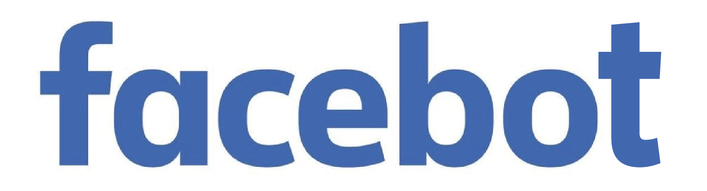

<p align="center">
  <a href="" rel="noopener">
 </a>
</p>

<h3 align="center">Scrape posts, reactions, comments, replies in facebook groups</h3>

<div align="center">

[]()
[](https://github.com/arthurdjn/facebook-hall-of-fame/issues)
[](https://github.com/arthurdjn/facebook-hall-of-fame/pulls)
[](/LICENSE)

</div>

---

<p align="center"> 🤖 A Facebook robot used to scrape data in your favorite group. You can retrieve statistics per user, and publish/edit posts automatically, without an API key.
<br> 
</p>

## ⚠️ Disclaimer <a name = "disclaimer"></a>

***Use only this project with people that consent to share personal data, or data publicly available. Hence, the developers of this tool won't be responsible for any misuse of data collected using this tool.*** 

## 🧐 About <a name = "about"></a>

The purpose of this API is to extract statistics from a group, for example the user who published the best post (post with the highest reactions). You can check the <a href="" name = "statistics">list of built-in statistics</a> for more details.

This bot is used to retrieve data in public/private groups.
**You must be part of the group to scrape its content.**
Then, you can retrieve textual data and post information (user, date, reactions/types, comments, replies) within a group. 

## Status <a name = "status"></a>

| Development                  | Status      | Feature                                                                |
| ---------------------------- | ----------- | ---------------------------------------------------------------------- |
| Group                        | finished    | <ul><li>[x] Public</li><li>[x] Private</li></ul> |
| Post                         | finished    | <ul><li>[x] Reactions</li><li>[x] Users</li><li>[x] Comments</li></ul> |
| Comment                      | finished    | <ul><li>[x] Reactions</li><li>[x] Users</li><li>[x] Replies</li></ul> |
| API                          | finished    | <ul><li>[x] Connect</li><li>[x] Publish Posts</li><li>[x] Edit Posts</li></ul> |
| Statistics                   | finished    | <ul><li>[x] Best Posts</li><li>[x] Best Comments</li><li>[x] Best Replies</li><li>[x] Most Posts</li><li>[x] Most Comments</li><li>[x] Most Replies</li><li>[x] Most Reactions</li><li>etc.</li></ul> |

## 🎥 Demo <a name = "demo"></a>

<p align="center">
    
    
</p>

You can also generate statistics with [built-in functions]() and [template]():

```
👑 𝐌𝐞𝐦𝐞𝐬 𝐀𝐜𝐭𝐮𝐬 👑  
Here is a template example for a meme group.

🔥 𝗚𝗹𝗼𝗯𝗮𝗹 𝗥𝗮𝗻𝗸𝗶𝗻𝗴 🔥  

🏅 𝘽𝙚𝙨𝙩 𝙈𝙚𝙢𝙚𝙨  
🥇 Top 1 User  
🥈 Top 2 User  
🥉 Top 3 User  

𝑒𝑡𝑐...

🔥 𝗛𝗼𝗻𝗼𝗿𝘀 🔥

📈 𝙈𝙤𝙨𝙩 𝘼𝙘𝙩𝙞𝙫𝙚    
🥇 Top 1 User  
🥈 Top 2 User    
🥉 Top 3 User   

𝑒𝑡𝑐...

🔥 𝗥𝗲𝗮𝗰𝘁𝗶𝗼𝗻𝘀 🔥  

😆 𝙁𝙪𝙣𝙣𝙞𝙚𝙨𝙩  
🥇 Top 1 User  
🥈 Top 2 User  
🥉 Top 3 User  

𝑒𝑡𝑐...

🕙 Message generated at 2020-12-12T19:44:10.600157
```

You can of course create your own <a href="" name = "template">template</a>.

## 💭 How it works 

The bot need a valid account to extract information. Then, it scrapes all posts in a Facebook group feed. For each post, it extracts the reactions, comments, replies and their respective reactions.

The scraping process is made with a Firefox webdriver, a.k.a ``geckodriver``. You can download one [here](https://github.com/mozilla/geckodriver/releases).

## ⛏️ Built Using <a name = "built_using"></a>

* `BeautifulSoup`
* `Selenium`
* `Python 3.8`

## 🏁 Getting Started <a name = "getting_started"></a>

These instructions will get you a copy of the project up and running on your local machine for development and testing purposes. 

### Prerequisites

Before using this project, make sure you have [Python 3.8](https://www.anaconda.com/products/individual#Downloads) and [Git](https://git-scm.com/download). 
You should also download a webdriver. You can find [geckodriver here](https://github.com/mozilla/geckodriver/releases).

### Installing

First, clone this repository using `git` in your terminal:

```
git clone https://github.com/arthurdjn/facebook-hall-of-fame
```

Then, install the dependencies using pip (should be installed with [Anaconda](https://www.anaconda.com/products/individual#Downloads)) in your Anaconda terminal:

```
pip install -r requirements.txt
```

If you have any issues using the above command, try installing each package separately, using:
```
pip install NameOfPackage
```

## 🎈 Usage <a name = "usage"></a>

#### ⚠️ Warning !

> To block scraping process and protect user's data, facebook uses dynamic CSS sheets. Thus, when a facebook page is refreshed or loaded, the HTML elements id change over time. To bypass this issue, this package uses a table of known elements, so the bot can be aware when an id changed in the CSS when a page refreshes.
<br><br>
**You will need to provide URLs to unique reactions. You can achieved that by creating a group, create multiple posts and associate for each a unique reaction (`LOVE`, `AHAH`, `LIKE` etc.). Then, click on the reaction and copy/paste its URL. Note that you should use the [mobile version of facebook](https://m.facebook.com) to retrive the URL and not the standard version of facebook.**


### API

Connect to the api:

```python
# Global parameters
EXECUTABLE_PATH = "driver/geckodriver.exe"
REACTION2HREF = {
    "LIKE":  "/ufi/reaction/profile/browser/?ft_ent_identifier=",
    "LOVE":  "/ufi/reaction/profile/browser/?ft_ent_identifier=",
    "CARE":  "/ufi/reaction/profile/browser/?ft_ent_identifier=",
    "AHAH":  "/ufi/reaction/profile/browser/?ft_ent_identifier=",
    "WOW":   "/ufi/reaction/profile/browser/?ft_ent_identifier=",
    "SAD":   "/ufi/reaction/profile/browser/?ft_ent_identifier=",
    "ANGER": "/ufi/reaction/profile/browser/?ft_ent_identifier="
}

EMAIL = "your_email"
PASSWORD = "your_password"

# Connect to the API
from halloffame import HallOfFameAPI

api = HallOfFameAPI(executable_path=EXECUTABLE_PATH, reaction2href=REACTION2HREF)
api.login(EMAIL, PASSWORD)

# Initialize the table of reactions
api.init_reactions()
```

Then, connect to a group and start scraping:
```python
# To retrieve everything (posts, comments, reactions)
posts = api.get_posts("your_group_id")

# To retrieve comments
comments = api.get_comments("your_group_id", "your_post_id")

# To retrieve reactions
reactions = api.get_reactions("your_post_id")
```

### Statistics

| Statistics                   | Description                                                                          |
| ---------------------------- | ------------------------------------------------------------------------------------ |
| `BEST-POST-REACTION`         | Ordered list of posts by their number of reactions (all categories)). |
| `BEST-COMMENT-REACTION`      | Ordered list of comments by their number of reactions (all categories)). |
| `BEST-REPLY-REACTION`        | Ordered list of replies by their number of reactions (all categories)). |
| `POST-COUNT`                 | Ordered list of user by their number of posts. |
| `REACTION-COUNT`             | Ordered list of user by their number of reactions. |
| `COMMENT-REPLY-COUNT`        | Ordered list of user by their number of comments and replies. |
| `COMMENT-COUNT`              | Ordered list of user by their number of comments only. |
| `REPLY-COUNT`                | Ordered list of user by their number of replies only. |
| `REACTION-AHAH`              | Ordered list of user by their number of `AHAH` reaction. |
| `REACTION-LOVE`              | Ordered list of user by their number of `LOVE` reaction. |
| `REACTION-CARE`              | Ordered list of user by their number of `CARE` reaction. |
| `REACTION-WOW`               | Ordered list of user by their number of `WOW` reaction. |
| `REACTION-SAD`               | Ordered list of user by their number of `SAD` reaction. |
| `REACTION-ANGER`             | Ordered list of user by their number of `ANGER` reaction. |
| `REACTION-LIKE`              | Ordered list of user by their number of `LIKE` reaction. |

You can compute the statistics from a list `posts` of `Post` using:

```python
from halloffame import get_top_stats

stats = get_top_stats(posts)
```

```
stats = {
    "BEST-POST-REACTION": [
        {
            "user_id": 97987,
            ...
        },
        ...
    ],
    ...
}
```

### Templates

To apply statistics in a facebook post, you can use a template: it will fasten your workflow.
Simply write the general structure of your text and wrap the elements that sill change (either stats or fonts) with `<< >>` tags.

For example, to apply a bold font on the text ``this is a text``, simply use ``<<BOLD>>this is a text<<BOLD>>``.
Same for statistics: ``<<TOP1-BEST-POST-REACTION>>``. Note that ``BEST-POST-REACTION`` is a list, so to get the first user add the token ``TOP1`` (and ``TOP2`` for the second etc.).
You can also use both together: ``<<BOLD>><<TOP1-BEST-POST-REACTION>><<BOLD>>``

```python
template = """
👑 <<BOLD-SERIF>>Hall Of Fame<<BOLD-ITALIC>> 👑  
Here is a template example for a meme group.

🔥 <<BOLD>>Rank<<BOLD>> 🔥  

🏅 <<BOLD-ITALIC>>Best Memes<<BOLD-ITALIC>>  
🥇 <<TOP1-BEST-POST-REACTION>>  
🥈 <<TOP2-BEST-POST-REACTION>>   
🥉 <<TOP3-BEST-POST-REACTION>>  

𝑒𝑡𝑐...

🔥 <<BOLD>>Honors<<BOLD>> 🔥

📈 <<BOLD-ITALIC>>Most Active<<BOLD-ITALIC>>      
🥇 <<TOP1-POST-COUNT>>  
🥈 <<TOP2-POST-COUNT>>  
🥉 <<TOP3-POST-COUNT>>   

𝑒𝑡𝑐...

🔥 <<BOLD>>Reactions<<BOLD>> 🔥  

😆 <<BOLD-ITALIC>>Funniest<<BOLD-ITALIC>>  
🥇 <<TOP1-REACTION-AHAH>>  
🥈 <<TOP2-REACTION-AHAH>>  
🥉 <<TOP3-REACTION-AHAH>>  

𝑒𝑡𝑐...

🕙 Message generated at <<DATE-NOW>> 
"""
```

Then,

```python
from halloffame import apply_template, get_top_stats

stats = get_top_stats(posts)
generated_text = apply_template(template, stats)
```
